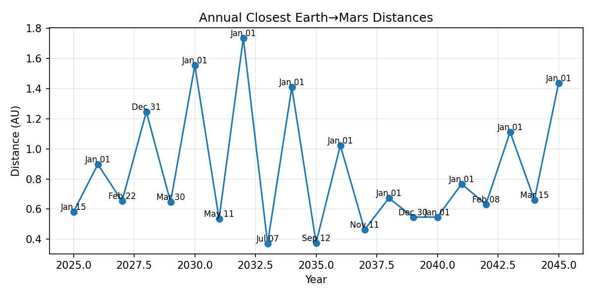
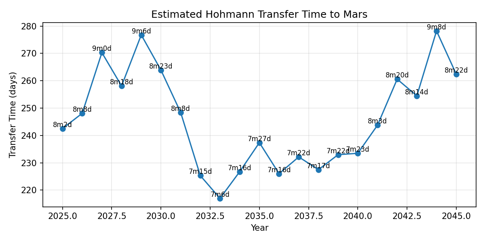

# 🚀 Best Time to Travel to Mars

This project visualizes **annual optimal launch windows** from Earth to Mars using planetary ephemeris data and Hohmann transfer orbit estimations. It provides a scientific and interactive tool to determine the best years and durations for interplanetary missions from 2025 to 2045.

  
*Annual Closest Earth→Mars Distances*

  
*Estimated Hohmann Transfer Time to Mars*

---

## 🔧 Features

- 🌍 Accurate Earth–Mars distance calculations using JPL DE421 ephemeris
- 📅 Annual closest approach dates for Mars from 2025 to 2045
- 🪐 Animated solar system orbit visualization
- 📈 Estimated transfer durations using orbital mechanics
- 🖼 Automatically saved visualizations

---

## 🧪 Requirements

Install the required Python packages:

```bash
pip install -r requirements.txt
Contents of requirements.txt:

nginx
Copy
Edit
skyfield
matplotlib
numpy
🚦 How to Use
Compute launch windows and travel times:
bash
Copy
Edit
python solar_system_orbits.py windows
Outputs:

launch_windows.png: Earth–Mars distance plot

travel_times.png: Hohmann transfer duration plot

Animate the Solar System:
bash
Copy
Edit
python solar_system_orbits.py
Launches an interactive animation of planetary orbits.

📁 Project Structure
bash
Copy
Edit
best_time_to_travel_to_mars/
├── de421.bsp               # Ephemeris file (JPL DE421)
├── solar_system_orbits.py # Main Python script
├── launch_windows.png      # Closest approach plot
├── travel_times.png        # Hohmann transfer duration plot
└── README.md               # Project documentation
📜 License
MIT License. You are free to use, modify, and distribute this project.

👨‍🚀 Author
Created with curiosity and caffeine by Your Name.
🌌 Inspired by exploration, powered by Python.

yaml
Copy
Edit

---

Let me know if you'd like a logo, GitHub badges, or advanced markdown formatting (like collapsible sections or 